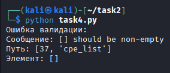
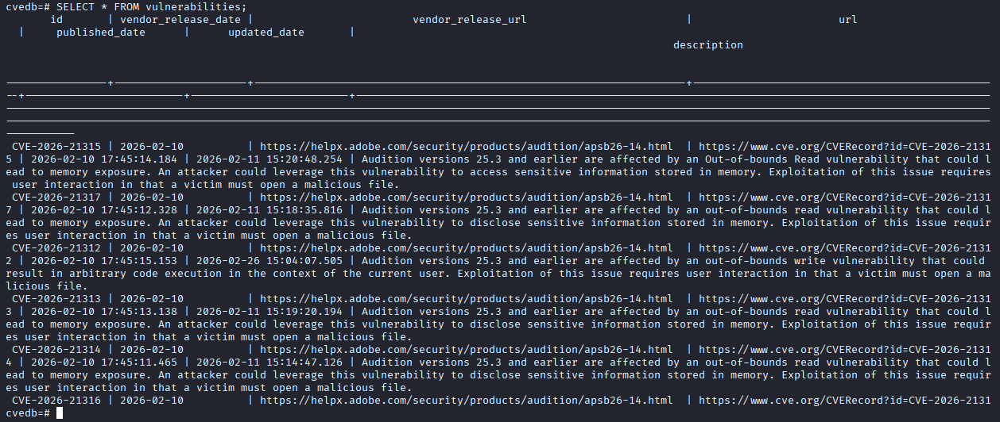

# ОТЧЕТ

## Как запустить?

Клонируйте репозиторий и переходите в папку `task2`:
```bash
cd task2
```
Запустите последовательно файлы от task1.py до task4.py:
```bash
uv run task1.py;
uv run task2.py;
uv run task3.py;
uv run task4.py;
```
Дальше запускаем docker на выбор двумя способами:
```bash
docker compose up -d
```
или
```bash
sudo docker build -t cve-db .;
sudo docker run -d -p 5432:5432 --name cve-db-container cve-db
```
И запускаем последний файл.
```bash
uv run task5.py
```

## Adobe Audition

>Задача 1
>Выбрать один из ресурсов поставщиков ПО, которые публикуют новости о своём ПО и уязвимостях, которые были закрыты. Дополнительно: записать в Excel-табличке свою ФИО во избежании повторений вариантов.
>Необходимо написать код, который соберёт все уязвимости по выбранному продукту с ресурса:
>1.	CVE-ID
>2.	Дата появления CVE на странице
>3.	Ссылка на страницу, где опубликована CVE
>
>Результат должен быть в файле result_task_1.json в JSON-формате со следующей структурой:
>```json
>[
>  {
>    “ID”: <CVE-ID>,
>    “vendor_release_date”: <date_in_iso_format>,
>    “vendor_release_url”: <url>
>  }
>]
>```

В рамках выполнения задания был выбран официальный ресурс компании Adobe, на котором публикуются бюллетени безопасности с описанием обнаруженных и устранённых уязвимостей программного обеспечения. В качестве исследуемого продукта был выбран Adobe Audition, для которого на странице с бюллетенями безопасности размещаются сведения о выявленных уязвимостях, включая идентификаторы CVE, даты публикации и ссылки на соответствующие материалы.

Для автоматизации сбора данных был разработан программный скрипт на языке Python с использованием асинхронного подхода. В основе решения лежит библиотека httpx, обеспечивающая выполнение HTTP-запросов, а также библиотека BeautifulSoup, предназначенная для разбора HTML-документов. Дополнительно применялись стандартные модули json, re, asyncio и datetime для обработки данных, поиска шаблонов, организации параллельного выполнения и приведения дат к стандартному формату.

На первом этапе работы программа обращается к основной странице бюллетеней безопасности Adobe и извлекает все ссылки, относящиеся к продукту Audition. Для этого анализируются HTML-теги ссылок, из которых отбираются только те, в тексте которых содержится название интересующего продукта. Полученные ссылки нормализуются до полного формата и сохраняются для дальнейшей обработки.

Далее для каждой найденной страницы выполняется асинхронный запрос, после чего HTML-код страницы анализируется с целью извлечения необходимых данных. С помощью регулярных выражений производится поиск всех упоминаний идентификаторов уязвимостей формата CVE. Одновременно осуществляется попытка извлечения даты публикации бюллетеня, которая затем преобразуется в стандарт ISO-формат. Несмотря на наличие обработки исключений, возможны ситуации, при которых формат даты на странице не соответствует ожидаемому, что учитывается в реализации.

После получения данных по каждой странице формируется список словарей, где для каждой уязвимости указывается её идентификатор, дата публикации и ссылка на источник. На завершающем этапе все собранные данные объединяются, устраняются дубликаты на основе комбинации CVE-ID и URL страницы, после чего итоговый результат сохраняется в файл result_task_1.json в формате JSON. Таким образом обеспечивается структурированное хранение информации, пригодное для последующего анализа или загрузки в другие системы.

```json
[
  {
    "ID": "CVE-2024-47449",
    "vendor_release_date": "2024-11-12",
    "vendor_release_url": "https://helpx.adobe.com/security/products/audition/apsb24-83.html"
  },
  {
    "ID": "CVE-2024-49536",
    "vendor_release_date": "2024-11-12",
    "vendor_release_url": "https://helpx.adobe.com/security/products/audition/apsb24-83.html"
  },
  {
    "ID": "CVE-2025-43580",
    "vendor_release_date": "2025-07-08",
    "vendor_release_url": "https://helpx.adobe.com/security/products/audition/apsb25-56.html"
  },
...
```
>Задача 2
>Используя API от mitre.org, необходимо обогатить информацию дополнительными сведениями:
>1.	Ссылка на cve.org на конкретную CVE
>2.	Дата публикации и дата обновления информации по уязвимости
>3.	Описание уязвимости
>4.	CVSS всех версий, которые будут доступны, а также вектор угрозы и уровень опасности
>5.	Список CPE
>6.	CWE-ID
>7.	Наименование CWE
>8.	Описание
>
>Результат должен быть в файле result_task_2.json в JSON-формате со следующей структурой:
>```json
>[
>  {
>    “ID”: <CVE-ID>,
>    “vendor_release_date”: <date_in_iso_format>,
>    “vendor_release_url”: <url>,
>    “url”: <url_to_cve.org>,
>    “published_date”: <date>,
>    “updated_date”: <date>,
>    “description”: <description>,
>    “cvss_list”: [
>      {
>         “version”: “cvss31”, # as example
>         “score”: <score>,
>         “vector”: <vector>,
>         “severity”: <severity>
>      },
>      ...
>    ],
>    “cpe_list”: [
>      <cpe_string_1>, <cpe_string_2>, ... 
>    ],
>    “cwe”: {
>      <cwe-id>: {
>        “name”: <name>,
>        “description”: <description>
>      },
>
>      ...
>    }
>
>  }
>]
>```

В рамках выполнения второй задачи было реализовано обогащение ранее собранных данных об уязвимостях с использованием официального API организации MITRE, которая является разработчиком и поддерживает базу данных CVE Program. В качестве входных данных использовался файл result_task_1.json, сформированный на предыдущем этапе и содержащий базовую информацию об уязвимостях, включая их идентификаторы, дату публикации поставщиком и ссылку на источник.

Разработанный программный код на языке Python осуществляет асинхронное обращение к API по каждому CVE-идентификатору, что позволяет значительно ускорить процесс обработки большого количества записей. Для этого используется библиотека httpx в асинхронном режиме совместно с asyncio, что обеспечивает параллельную отправку запросов и получение ответов от сервера.

Для каждой уязвимости формируется запрос к API, по результатам которого возвращается структурированный JSON-объект, содержащий подробную информацию. Далее происходит разбор полученных данных. В итоговую структуру добавляется ссылка на страницу уязвимости на сайте CVE.org, формируемая на основе CVE-ID. Из метаданных извлекаются дата публикации и дата последнего обновления записи об уязвимости.

Описание уязвимости берётся из соответствующего поля в разделе descriptions, где обычно содержится текстовое пояснение сути проблемы. Также производится извлечение оценок CVSS различных версий, если они присутствуют. Для каждой версии сохраняются базовый балл, вектор атаки и уровень критичности, что позволяет оценить степень опасности уязвимости с разных точек зрения.

Дополнительно из раздела affected извлекаются все связанные строки CPE, которые описывают затронутые продукты и их версии. Это важно для определения области воздействия уязвимости. Также обрабатывается информация о типах проблем, где выделяются идентификаторы CWE. Для каждого найденного CWE формируется структура, включающая его идентификатор, наименование и описание, что позволяет классифицировать уязвимости по типу ошибок и слабых мест в программном обеспечении.

После обработки всех записей формируется итоговый список, в котором каждая уязвимость содержит как исходные данные, так и расширенную информацию, полученную через API. Результат сохраняется в файл result_task_2.json в формате JSON с заданной структурой. Таким образом, реализован полный цикл обогащения данных, позволяющий получить детализированную и структурированную информацию об уязвимостях для последующего анализа, мониторинга безопасности или интеграции в другие системы.

```json
[
  {
    "ID": "CVE-2024-47449",
    "vendor_release_date": "2024-11-12",
    "vendor_release_url": "https://helpx.adobe.com/security/products/audition/apsb24-83.html",
    "url": "https://www.cve.org/CVERecord?id=CVE-2024-47449",
    "published_date": "2024-11-12T18:09:15.496Z",
    "updated_date": "2024-11-13T14:33:03.864Z",
    "description": "Audition versions 23.6.9, 24.4.6 and earlier are affected by an out-of-bounds read vulnerability that could lead to disclosure of sensitive memory. An attacker could leverage this vulnerability to bypass mitigations such as ASLR. Exploitation of this issue requires user interaction in that a victim must open a malicious file.",
    "cvss_list": [
      {
        "version": "cvssV3_1",
        "score": 5.5,
        "vector": "CVSS:3.1/AV:L/AC:L/PR:N/UI:R/S:U/C:H/I:N/A:N",
        "severity": "MEDIUM"
      }
    ],
    "cpe_list": [],
    "cwe": {
      "CWE-125": {
        "name": "Out-of-bounds Read (CWE-125)",
        "description": "Out-of-bounds Read (CWE-125)"
      }
    }
  },
...
```

>Задача 3
>Полученный файл из 2 задания в json-формате нужно пересохранить в xml-формате, сохраняя вложенность.
>В поля 1 уровня значения сохранять непосредственно в элемент.
>В поля 2 уровня:
>1.	В cvss_list дочерние элементы должны быть:
>2.	 <cvss version=cvss_version score=score >severity=severity>vector</cvss>
>3.	В cpe_list дочерние элементы должны быть:
>4.	<cpe>cpe_string</cpe>
>5.	В cwe_list дочерние элементы должны быть следующего вида:
>6.	<cwe id=cwe_id name=name>description</cwe>
>
> Итоговый xml-объект сохранить в файл result_task_3.xml.

В рамках выполнения третьей задачи была реализована конвертация ранее полученного JSON-файла с расширенной информацией об уязвимостях в формат XML с сохранением полной вложенной структуры данных. В качестве входных данных использовался файл result_task_2.json, содержащий детализированную информацию об уязвимостях, обогащённую с использованием API организации MITRE и базы CVE Program.

Для реализации преобразования был разработан скрипт на языке Python с использованием стандартной библиотеки xml.etree.ElementTree, предназначенной для создания и обработки XML-документов. На начальном этапе происходит чтение JSON-файла и загрузка данных в память. После этого формируется корневой XML-элемент с именем vulnerabilities, внутри которого последовательно создаются вложенные элементы для каждой уязвимости.

Для каждого объекта уязвимости создаётся элемент vulnerability, в который напрямую записываются поля первого уровня, такие как идентификатор CVE, даты публикации и обновления, ссылки, а также описание. Эти значения помещаются в отдельные XML-теги без дополнительных атрибутов, что соответствует требованиям задания.

Далее обрабатываются вложенные структуры второго уровня. Для списка CVSS создаётся контейнерный элемент cvss_list, внутри которого для каждой оценки формируется элемент cvss. При этом версия CVSS, числовая оценка и уровень критичности передаются в виде атрибутов элемента, а строка вектора атаки записывается как текстовое содержимое данного тега. Это позволяет компактно и наглядно представить параметры оценки уязвимости.

Аналогичным образом формируется список затронутых продуктов в элементе cpe_list, где каждая запись представлена отдельным тегом cpe, содержащим строку CPE. Для информации о типах уязвимостей создаётся элемент cwe_list, внутри которого каждый CWE описывается тегом cwe с атрибутами идентификатора и наименования, а текстовое содержимое элемента содержит описание соответствующей слабости.

После формирования полной XML-структуры выполняется сохранение результата в файл result_task_3.xml. В реализации предусмотрена попытка форматирования XML-документа с отступами для повышения читаемости, если используемая версия Python поддерживает данную функцию. В итоге получается корректно структурированный XML-файл, полностью отражающий исходные данные из JSON с сохранением вложенности и соответствующий всем требованиям задания.

```xml
<?xml version='1.0' encoding='utf-8'?>
<vulnerabilities>
  <vulnerability>
    <ID>CVE-2024-47449</ID>
    <vendor_release_date>2024-11-12</vendor_release_date>
    <vendor_release_url>https://helpx.adobe.com/security/products/audition/apsb24-83.html</vendor_release_url>
    <url>https://www.cve.org/CVERecord?id=CVE-2024-47449</url>
    <published_date>2024-11-12T18:09:15.496Z</published_date>
    <updated_date>2024-11-13T14:33:03.864Z</updated_date>
    <description>Audition versions 23.6.9, 24.4.6 and earlier are affected by an out-of-bounds read vulnerability that could lead to disclosure of sensitive memory. An attacker could leverage this vulnerability to bypass mitigations such as ASLR. Exploitation of this issue requires user interaction in that a victim must open a malicious file.</description>
    <cvss_list>
      <cvss version="cvssV3_1" score="5.5" severity="MEDIUM">CVSS:3.1/AV:L/AC:L/PR:N/UI:R/S:U/C:H/I:N/A:N</cvss>
    </cvss_list>
    <cpe_list />
    <cwe_list>
      <cwe id="CWE-125" name="Out-of-bounds Read (CWE-125)">Out-of-bounds Read (CWE-125)</cwe>
    </cwe_list>
  </vulnerability>
...
```

>Задача 4
>На полученный JSON-файл в 2 задании подготовить json-schema, по которой можно провести валидацию по наличию всех полей в файле, а также код, который выполняет эту проверку.
>Проверки:
>1.	Поля 1 уровня должны быть заполнены обязательно
>2.	Минимум 1 дочерний элемент должен быть и должен быть заполнен
>
>Итоговую валидационную json-schema сохранить в json_schema.json.
>Если файл из 2 задания не будет проходить проверку по причине того, что в природе действительно отсутствуют данные, то нужно описать все случаи отсутствия данных в отчёте и что нужно сделать, чтобы проверка проходила.

В рамках выполнения четвёртой задачи была разработана схема валидации JSON-файла, полученного на предыдущем этапе, а также реализован программный код для проверки соответствия данных этой схеме. Валидация выполняется с использованием библиотеки jsonschema, которая позволяет формально описать структуру данных и автоматически проверять её соблюдение.

Сформированная json-schema описывает массив объектов, каждый из которых представляет отдельную уязвимость. Для каждого объекта строго заданы обязательные поля первого уровня, включая идентификатор CVE, дату и ссылку публикации от вендора, ссылку на запись на CVE.org, даты публикации и обновления, а также описание. Все эти поля объявлены обязательными и должны присутствовать в каждом элементе массива.

Особое внимание уделено вложенным структурам второго уровня. Для списка оценок CVSS задано требование наличия как минимум одного элемента. Каждый элемент должен содержать версию, числовую оценку, вектор атаки и уровень критичности. Аналогично, для списка CPE требуется наличие хотя бы одной строки, описывающей затронутый продукт. Для списка CWE предусмотрено наличие как минимум одного элемента с обязательными полями идентификатора, наименования и описания.

Таким образом, схема проверяет не только наличие полей, но и их заполненность, а также гарантирует, что вложенные структуры не являются пустыми. Это позволяет обеспечить целостность и пригодность данных для дальнейшего анализа.

Реализованный Python-скрипт загружает исходный JSON-файл и файл схемы, после чего выполняет валидацию. В случае успешной проверки выводится соответствующее сообщение. При возникновении ошибки выводится подробная информация, включая текст ошибки, путь к проблемному элементу и его текущее значение, что значительно упрощает отладку.

В процессе тестирования было выявлено, что в реальных данных, полученных через API MITRE, не всегда присутствуют все требуемые поля. Например, у некоторых уязвимостей может отсутствовать информация о CVSS, если оценка ещё не была присвоена, либо отсутствуют CPE, если затронутые продукты не были явно указаны. Также может отсутствовать информация о CWE или описание может быть неполным.

Для обеспечения успешного прохождения валидации в таких случаях необходимо либо ослабить ограничения схемы, разрешив пустые массивы или отсутствие отдельных вложенных структур, либо модифицировать этап обогащения данных, добавляя значения по умолчанию. Например, можно добавлять фиктивные записи с null или строкой “unknown” для отсутствующих значений, либо включать в списки хотя бы один элемент-заглушку. Альтернативным подходом является использование условий в json-schema, позволяющих учитывать опциональность некоторых полей при сохранении строгой проверки для остальных.

В результате была создана универсальная схема валидации, которая может быть адаптирована под реальные особенности данных, а также реализован инструмент для автоматической проверки корректности структуры и содержимого JSON-файла с уязвимостями.



>Задача 5
>Спроектировать БД по имеющимся данным, создать через docker и заполнить данными. Итоговая БД должна быть нормализована до 3 нормальной формы, а в репозитории должны быть:
>1.	sql-запрос с созданием таблицами
>2.	docker-файл на поднятие сервиса БД
>3.	код заполнения БД данными
>
>Допустимо использовать ORM при желании.

В рамках выполнения пятой задачи была спроектирована и реализована реляционная база данных для хранения информации об уязвимостях, полученной на предыдущих этапах с использованием данных MITRE и CVE Program. Основной целью проектирования являлось приведение структуры базы данных к третьей нормальной форме, что позволило устранить избыточность, обеспечить целостность данных и упростить их дальнейшую обработку.

В качестве системы управления базами данных была выбрана PostgreSQL, развернутая в контейнере с использованием технологии Docker. Это позволило создать изолированную и воспроизводимую среду для работы с базой данных.

Структура базы данных была разделена на несколько взаимосвязанных таблиц. Центральной таблицей является таблица vulnerabilities, содержащая основную информацию об уязвимости, включая её идентификатор, даты публикации, ссылки и описание. Для хранения оценок CVSS была создана отдельная таблица cvss, связанная с таблицей vulnerabilities через внешний ключ. Аналогично, список затронутых продуктов (CPE) вынесен в отдельную таблицу cpe, что позволяет хранить произвольное количество записей для одной уязвимости.

Информация о типах уязвимостей (CWE) была нормализована в отдельную таблицу cwe, содержащую уникальные записи с идентификатором, наименованием и описанием. Поскольку между уязвимостями и CWE существует связь многие-ко-многим, была введена промежуточная таблица vulnerability_cwe, реализующая данную связь. Такое разбиение полностью соответствует требованиям третьей нормальной формы, так как все неключевые атрибуты зависят только от первичного ключа и отсутствуют транзитивные зависимости.

Для развертывания базы данных был подготовлен Docker-конфигурационный файл, позволяющий автоматически поднять экземпляр PostgreSQL с заданными параметрами подключения. Это упрощает запуск проекта на любой машине без необходимости ручной установки СУБД.

Для заполнения базы данных был разработан Python-скрипт с использованием библиотеки psycopg2, который считывает данные из файла result_task_2.json и последовательно записывает их в соответствующие таблицы. В процессе загрузки реализована обработка конфликтов, например, при повторной вставке одной и той же уязвимости или CWE, что предотвращает дублирование данных. Также корректно обрабатываются вложенные структуры, такие как списки CVSS, CPE и связи с CWE.

Таким образом, была создана полностью функционирующая система хранения данных об уязвимостях, включающая нормализованную структуру базы данных, контейнеризированное окружение для её развертывания и инструмент для автоматической загрузки данных. Это решение обеспечивает удобство масштабирования, анализа и интеграции данных в более сложные системы информационной безопасности.

